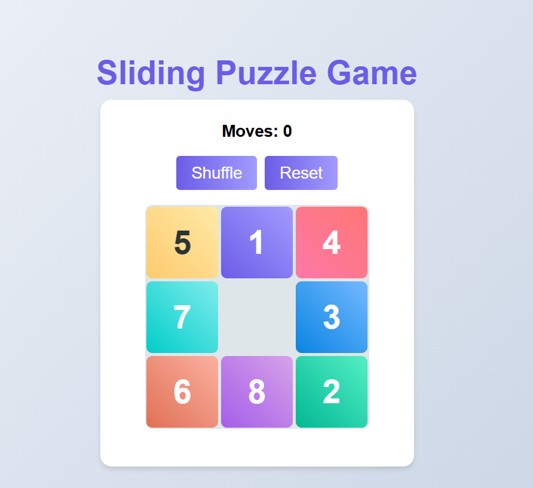

# Sliding Puzzle Game 🧩

A classic 3x3 sliding puzzle game built with HTML, CSS, and JavaScript. Move the tiles to arrange them in numerical order from 1 to 8 with the empty space at the bottom right.

 *(Replace with actual screenshot)*

## Features ✨

- 🎨 Colorful gradient tiles with numbers
- 🔊 Sound effects for moves and winning
- ⌨️ Keyboard controls (arrow keys)
- 📊 Move counter to track your progress
- 🏆 Win detection with celebration message
- 🔄 Shuffle and reset functionality
- 📱 Responsive design that works on mobile and desktop

## How to Play 🕹️

1. Use your mouse to click on adjacent tiles to move them into the empty space
2. Alternatively, use arrow keys (↑ ↓ ← →) to slide tiles
3. Arrange all tiles in order from 1 to 8 with the empty space at the bottom right
4. Try to solve the puzzle in as few moves as possible!

Project Structure 📂
sliding-puzzle/
├── index.html          # Main HTML file
├── styles.css          # CSS styles
├── script.js           # JavaScript game logic
├── README.md           # This file
└── assets/             # (Optional) For storing images/sounds
    ├── move-sound.mp3
    └── win-sound.mp3

Customization 🎨
You can easily customize:

Game size by changing the size variable in script.js

Colors by modifying the gradient classes in styles.css

Sounds by replacing the audio files or URLs

Technologies Used 💻
HTML5

CSS3 (Flexbox, Gradients, Transitions)

JavaScript (DOM Manipulation, Event Handling)

Web Audio API
